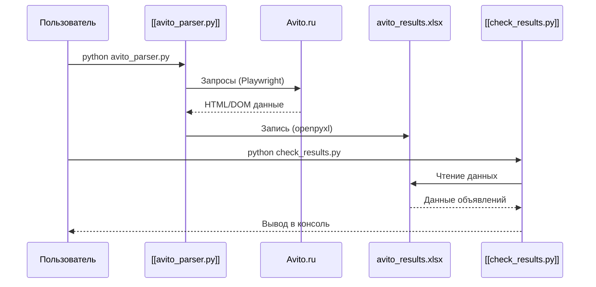

# Public Interface & Contracts

Данный репозиторий представляет собой набор скриптов автоматизации (парсер и анализатор данных) на языке Python, а не классическое веб-приложение с HTTP API. Взаимодействие осуществляется через исполнение скриптов в терминале и манипуляцию файлами Excel.

## Interface Map

## Endpoints / Exports

Репозиторий не предоставляет сетевых эндпоинтов. Публичным интерфейсом являются точки входа для исполнения скриптов:

*   **`python avito_parser.py`**: Запускает процесс сбора данных.
    *   **Контракт**: Читает конфигурационные переменные (`PRICE_MIN`, `PRICE_MAX`, `SEARCH_QUERIES`) внутри модуля [[avito_parser.py]].
    *   **Результат**: Создает или обновляет файл `avito_results.xlsx`.
*   **`python check_results.py`**: Запускает процесс анализа собранных данных.
    *   **Контракт**: Требует наличия файла `avito_results.xlsx` в корневой директории.
    *   **Результат**: Вывод отфильтрованных данных в стандартный поток вывода (stdout).

## Data Models

Данные передаются между компонентами через неструктурированный файл Excel (`avito_results.xlsx`).

*   **Внутренняя структура (Python DTO)**:
    Скрипт [[avito_parser.py]] оперирует объектами `list[dict]`, которые впоследствии сериализуются в строки Excel. Ожидаемые ключи (на основе логики парсинга):
    *   `title` (str): Название объявления.
    *   `price` (int): Цена.
    *   `url` (str): Ссылка.
    *   `score` (int): Рассчитанная "оценка крутости".
    *   `condition` (str): Состояние устройства.

> [!CAUTION]
> Схема данных в `avito_results.xlsx` не является строго типизированной. Любое изменение логики парсинга в [[avito_parser.py]] без обновления [[check_results.py]] приведет к ошибкам выполнения (Runtime Errors).

## Contract Risks

1.  **Отсутствие API контракта**: Взаимодействие с Avito.ru основано на скрапинге (DOM-структуре). Любое изменение верстки сайта Avito приведет к поломке контракта парсинга.
2.  **Файловая зависимость**: [[check_results.py]] жестко завязан на путь `avito_results.xlsx`. Отсутствие файла или прав на запись приведет к аварийному завершению.
3.  **Стабильность**: Отсутствие версионирования схемы данных делает систему крайне хрупкой при масштабировании.