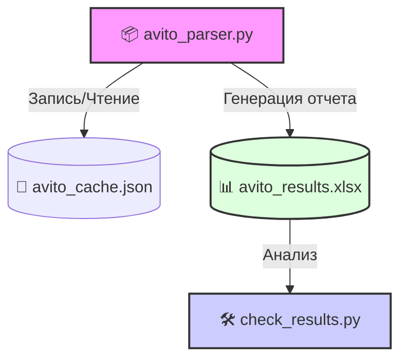

# 🏗️ Deep Engineering Architecture

## 🔄 Global Data Flow
Система представляет собой автономный конвейер извлечения и анализа данных, реализованный на Python. Поток данных состоит из двух независимых этапов: парсинга (сбор данных) и верификации (анализ результатов).

> [!NOTE]
> Легенда:
> - [[avito_parser.py]] — основной движок сбора данных, использующий Playwright.
> - [[check_results.py]] — утилита постобработки для анализа сформированного Excel-отчета.
> - [[.gitignore]] — конфигурация исключения временных файлов и артефактов парсинга.

---

## 🧩 Module Deep-Dives

### Module: [[avito_parser.py]]
- **Responsibility**: Осуществление автоматизированного сбора данных с платформы Avito, управление кэшированием запросов и формирование итогового Excel-отчета.
- **Internal Logic**: Использует [[playwright.async_api]] для эмуляции поведения браузера, обхода капчи и извлечения контента. Реализует логику формирования URL, парсинга страниц и сериализации данных в формат `openpyxl`.
- **Upstream Callers**: Нет (является точкой входа).
- **Downstream Dependencies**: `asyncio`, `re`, `json`, `os`, `urllib.parse`, `playwright`, `openpyxl`.

### Module: [[check_results.py]]
- **Responsibility**: Чтение и фильтрация данных из сгенерированного Excel-файла для быстрой оценки эффективности парсинга.
- **Internal Logic**: Прямое чтение файла через [[openpyxl]], итерация по строкам и вывод в консоль отфильтрованных предложений.
- **Upstream Callers**: Нет (запускается вручную как скрипт анализа).
- **Downstream Dependencies**: `openpyxl`.

---

## 🛡️ Structural Risks

> [!WARNING]
> Система характеризуется высокой степенью риска из-за отсутствия модульной структуры и наличия «сиротских» модулей.

- **Hotspots**: [[avito_parser.py]] является критическим узлом с высокой сложностью (356). Любое изменение логики парсинга требует глубокого тестирования всей цепочки.
- **Orphan Modules**: Все основные компоненты ([[avito_parser.py]], [[check_results.py]]) являются сиротами в графе зависимостей. Это означает, что они не интегрированы в общую библиотечную структуру и представляют собой разрозненные скрипты.
- **Graph Reliability**: Отсутствуют внутренние связи между модулями. Это затрудняет масштабирование и автоматическое тестирование.

---

## ⚙️ Change Playbooks

### Изменение логики парсинга (например, добавление нового поискового запроса)
1. Откройте [[avito_parser.py]].
2. Найдите константу `SEARCH_QUERIES`.
3. Добавьте новый элемент в список.
4. Выполните запуск скрипта: `python avito_parser.py`.
5. Проверьте актуальность данных, запустив [[check_results.py]].

### Обновление формата отчета
1. Модифицируйте функцию `save_to_excel` в [[avito_parser.py]].
2. При изменении структуры столбцов, обновите индексы ячеек в [[check_results.py]], чтобы предотвратить ошибки чтения данных.
3. Проведите валидацию корректности записи и последующего чтения файла.

> [!CAUTION]
> Перед внесением изменений убедитесь, что структура `avito_results.xlsx` соответствует ожиданиям обоих скриптов, так как жесткая привязка к индексам ячеек является архитектурно слабой точкой.